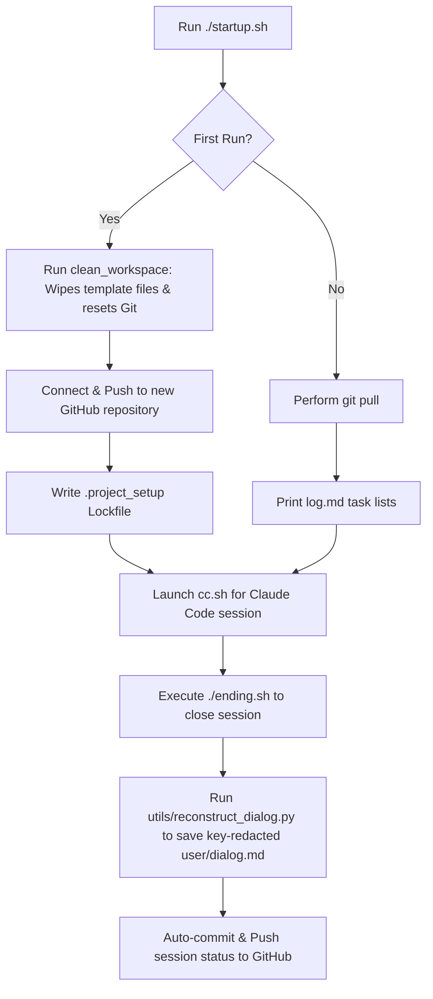

# 🚀 2026 StartEndShell Project Template (v2.1 Consolidated)

This is a premium, highly consolidated shell session framework designed for managing development workflows seamlessly with **Claude Code** and advanced AI coding agents. It automates first-run project bootstrapping, session state synchronization, workspace sanitization, and secure dialogue reconstruction.

## 🚀 Quick Start

```bash
./startup.sh   # Warm start: auto-verifies environment, handles first-run setup/cleanup, pulls, and launches Claude Code CLI
./ending.sh    # Session closer: auto-reconstructs dialogue, redacts keys, commits, and pushes to remote
```

---

## 🤖 Unified Flow (How it Works)



---

## 🧭 Project Structure

```text
.
├── startup.sh         # Opener: auto-detects first-run (resets git, sanitizes directories), pulls, and boots cc.sh
├── ending.sh          # Closer: rebuilds dialogue logs, auto-commits under timestamps, and pushes to remote
├── cc.sh              # Unified CLI Launcher: direct entry to Claude Code CLI
├── .env               # API Keys and target repository configurations (GIT IGNORED)
├── .env.bak           # Template for API Keys and repository settings configurations
├── log.md             # Chronological development log (read/updated in each session)
├── CLAUDE.md          # Karpathy-style behavior rules for AI coding agents
├── README.md          # Project guide (this file)
└── utils/
    └── reconstruct_dialog.py # Dialogue parser: compiles model brain logs to user/dialog.md with redacting
```

---

## 🎬 Remotion & AI Agent Skills

This repository is fully configured for building React-based video animations using **Remotion**. It includes pre-loaded **Agent Skills** that allow AI helpers (like Claude Code, Codex, Gemini) to strictly follow official best practices.

### 📁 Remotion Project Structure
All Remotion code is neatly structured in the `remotion/` subdirectory:
```bash
remotion/
├── src/
│   ├── Root.tsx         # Remotion compositions entry point
│   ├── index.ts         # Direct entry script
│   └── HelloWorld/      # Default starter animation assets
├── remotion.config.ts   # Remotion CLI configuration settings
└── package.json         # Dependencies and scripts (React, Remotion, Prettier)
```

### ⚡ Quick Commands inside `remotion/`
```bash
cd remotion
npm run dev              # Starts the local Remotion Preview Server
npx remotion render      # Compiles the default HelloWorld animation into out/video.mp4
```

### 🧠 Agent Skills (`.agents/skills`)
To make AI programming (via Claude, Gemini, Codex, or Cursor) fast and bug-free, the official `remotion-best-practices` skills have been provisioned in the project:
* **Pre-loaded Skills**: Located at `.agents/skills/remotion-best-practices` and `remotion/.agents/skills/remotion-best-practices`.
* **How it helps**: When you ask Claude, Gemini, or Codex to create or modify compositions in the `remotion/` directory, the agents automatically read these rules to ensure perfect React hook usage, precise frame-rate timings, audio-video synchronization, and optimal asset bundling.
* **Gist Reference**: This guidelines structure is adapted from the official [ThariqS/Remotion Claude.md Gist](https://gist.github.com/ThariqS/3d446e7c7aa9eb94f468194deb73028f#claudemd).

---

## 🛠️ Setup & Configuration

1. **API Credentials & Project Goal Setting**:
   - Copy `.env.bak` to `.env` in the root directory:
     ```bash
     cp .env.bak .env
     ```
   - Open `.env` and fill in your keys:
     - `ANTHROPIC_API_KEY`: Your official Anthropic key.
     - `REPO_NAME`: *(Optional)* Pre-assign your target GitHub repository name (e.g. `"2026Remotion_test"`). If left empty, `startup.sh` will guide you interactively.
   - Describe your core project goals in `project_initial.md` (which will be read upon setup).

2. **Run Initialization**:
   - Simply start by running:
     ```bash
     ./startup.sh
     ```
   - On the **first run**, `startup.sh` will automatically:
     - Reset your repository history to remove the template.
     - Prompt you to connect or automatically provision a repository under your GitHub account.
     - Sanitize all folder paths and files to build a pristine workspace.
     - Generate a lockfile (`.project_setup`) so subsequent runs boot straight into your session.

3. **Develop with Guardrails**:
   - The template loaded **Karpathy-style AI agent rules** inside `CLAUDE.md`. These guidelines instruct AI coding assistants to use surgical diffs, simplicity first, pre-coding statements, and regular log keeping to minimize mistakes.

4. **Conclude Sessions**:
   - When ending your workday, execute:
     ```bash
     ./ending.sh
     ```
   - This automatically updates `log.md`, processes key-redacted conversation logs into `user/dialog.md`, commits all changes with a timestamp, and pushes them up to GitHub.

---

## 📝 Prerequisites
- **Node.js & npx** — required to run the official Claude Code CLI.
- **Git & Curl** — for remote synchronization and status testing.
- **GitHub CLI (`gh`)** *(Optional)* — if you wish to allow `startup.sh` to automatically provision public/private repositories on your GitHub account.
